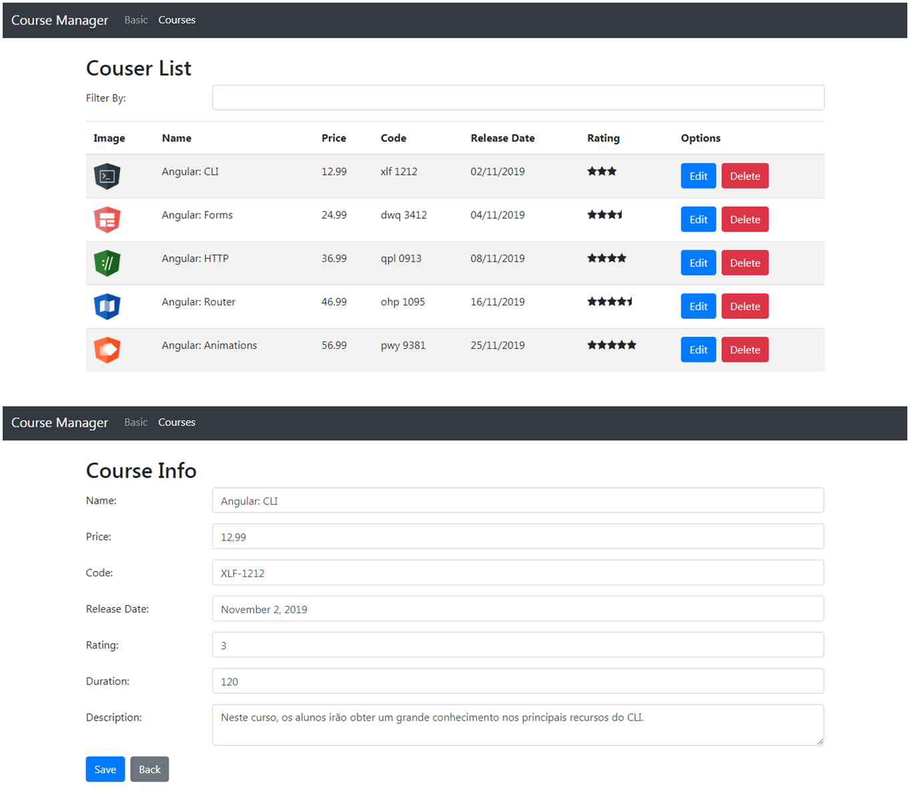

## :rocket: Introdução ao Angular 8

### :art: Layout

  

----------

### :link: Instalar Dependências

npm install

----------

### :computer: Servidor de Desenvolvimento

Execute ng serve para iniciar a aplicação na porta http://localhost:4200/.

----------

### :hammer_and_wrench: Ferramentas
As seguintes tecnologias foram utilizadas na construção do projeto:
- Angular;
  - Data Biding;
  - Datas com Pipes;
  - Rotas com Guards;
  - Requisições HTTP.
- HTML;
- Bootstrap;
- CSS;
- TypeScript;
- Visual Studio Code.

----------

###  :gear: Função

- [x] CRUD de Cursos;

----------

###  :eyeglasses: Autor
José Gustavo da Silva.
 

